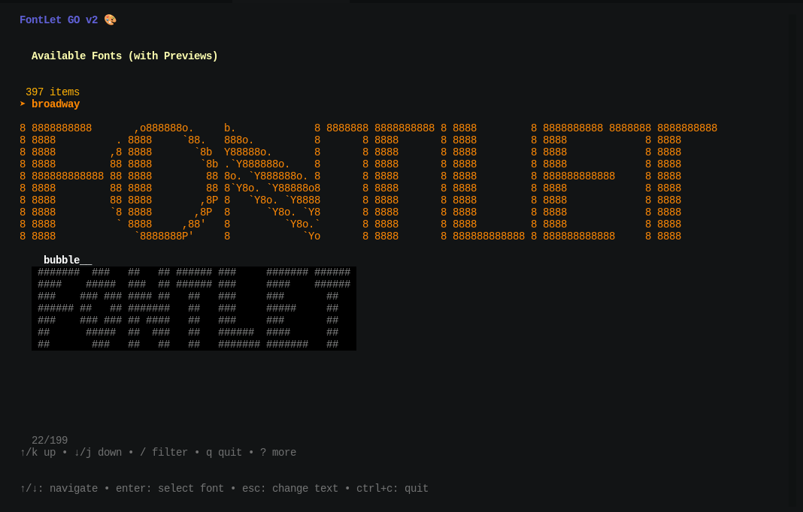

# Fontlet - A TUI for figlet written in Go

[](https://stand-with-ukraine.pp.ua)

---

A TUI (Text User Interface) for `figlet` written in Go, allowing you to preview text in all installed Figlet fonts with live previews in the list and options to output to the terminal or save to a file.



---

> [!CAUTION]
> Fontlet is still very early in development and has only just been made available.
> Feel free to fork this repo and even contribute.
> Fontlet has only been tested on Ubuntu 25.04

---

> [!INFO]
> Fontlet was coded with the help of generative AI to help me with my PTSD and ADHD.
> If you believe in restrictions against generative AI, Google, Microsoft, Putin, and Xi offer you their thanks.
> They will be the only ones able to ignore those restrictions.

---

## Features

* **Interactive TUI:** Easy-to-use text-based interface.
* **Live Font Previews:** See your text rendered in each Figlet font directly in the selection list.
* **Comprehensive Font Listing:** Automatically detects and lists available Figlet fonts.
* **Output Options:**
  * Display the full Figlet output in a scrollable terminal view.
  * Save the Figlet output directly to a file.
* **Cross-Platform:** Built with Go, aiming for compatibility where Go and Figlet run.

## Prerequisites

Before installing Fontlet, please ensure you have the following installed:

1. **Go:** Version 1.20 or newer. You can find installation instructions at [go.dev/dl/](https://go.dev/dl/).
2. **Figlet:** The `figlet` command-line tool must be installed and available in your system's PATH.
    * On Debian/Ubuntu: `sudo apt install figlet`
    * On Fedora: `sudo dnf install figlet`
    * On macOS (via Homebrew): `brew install figlet`

## Installation

There are a couple of ways to install Fontlet:

### Option 1: Using `go install` (Recommended for most users)

You can install it directly using:

```bash
go install [git@github.com:TheLustriVA/fontlet.gi](git@github.com:TheLustriVA/fontlet.git)
```

This will download, compile, and install the fontlet binary to your Go binary directory (usually `$HOME/go/bin` or `$GOBIN`). Ensure this directory is in your system's PATH.

### Option 2: Build from Source

If you prefer to build from source or want to make modifications:

```bash

git clone [git@github.com:TheLustriVA/fontlet.gi](git@github.com:TheLustriVA/fontlet.gi)
cd fontlet
go build -o fontlet .
# Then you can run it directly: ./fontlet "Your Text"
# Or move the 'fontlet' binary to a directory in your PATH, e.g.:
# sudo mv fontlet /usr/local/bin/
```

## Use

To use Fontlet, simply run the command followed by the text you want to figletize:

```bash
fontlet "Hello World!"
```

This will launch the TUI where you can:

* Confirm or edit your input text.
* Scroll through the list of Figlet fonts with live previews.
* Select a font.
* Choose to display the output in the terminal or save it to a file.

## Keybindings

Fontlet uses fairly standard TUI keybindings:

```txt
    Global:
        Ctrl+C: Quit the application at any time.
    Text Input Screen (Initial text & Filename input):
        Enter: Confirm input.
        Esc: Cancel (e.g., when saving a file, to go back to output choice).
    Font Selection List:
        ↑/↓ or j/k: Navigate the list.
        Enter: Select the highlighted font.
        Esc: Go back to the initial text input screen.
        Type to filter fonts.
    Output Choice Prompt ((t)erminal or (f)ile?):
        t: Display in terminal.
        f: Proceed to save to file.
        Esc: Go back to the font selection list.
    Terminal Display View:
        ↑/↓, PgUp/PgDown, j/k: Scroll the output.
        Esc or q: Go back to the font selection list.
```

## Customization

For users building from source, you can customize the height of the live previews in the font list by modifying the previewLines constant at the top of the main.go file:

```go
// --- Configuration ---
const (
 previewLines = 4 // Adjust this value (e.g., 3, 5)
)
```

After changing the value, rebuild the application (`go build -o fontlet .`).

## Contributing

Fontlet is still very early in development and has only just been made available. Feel free to fork this repo and even contribute.

If you'd like to contribute, please:

* Fork the repository.
* Create a new branch for your feature or bug fix.
* Make your changes.
* Open a Pull Request with a clear description of your changes.

Reporting bugs or suggesting features via GitHub Issues is also welcome!

## Acknowledgements

```txt
    Built with Go and the wonderful Bubble Tea library by Charm.
    Relies on the classic figlet command-line tool for generating the text art.
```

## License

This project is licensed under the MIT License. See the [LICENSE](LICENSE) file for details.
